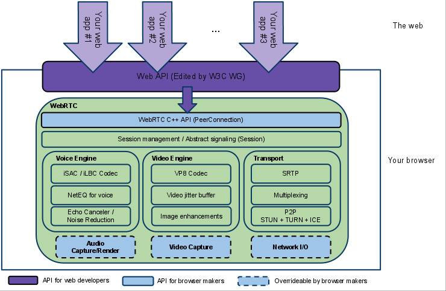
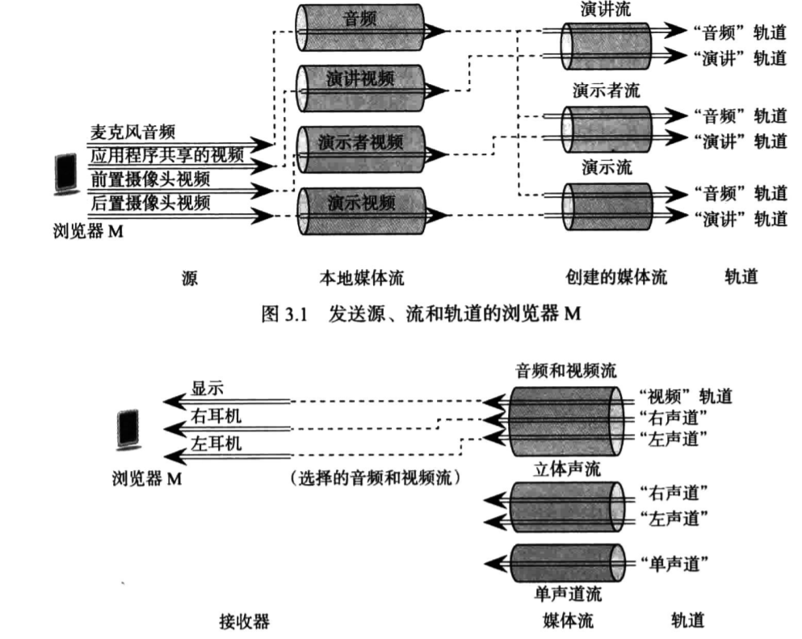
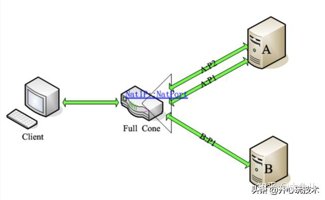
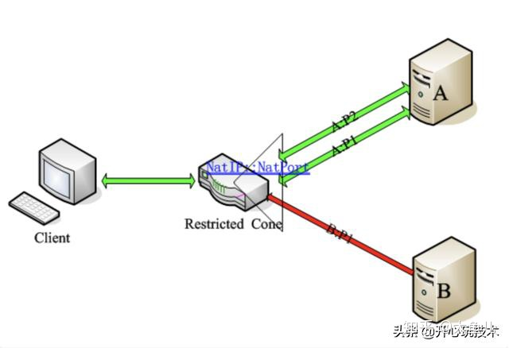
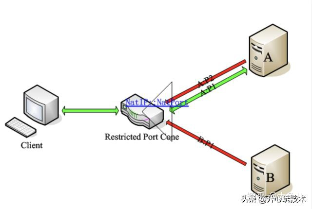
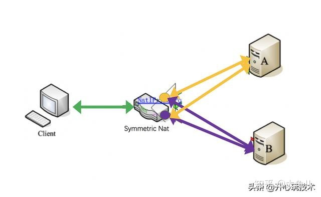
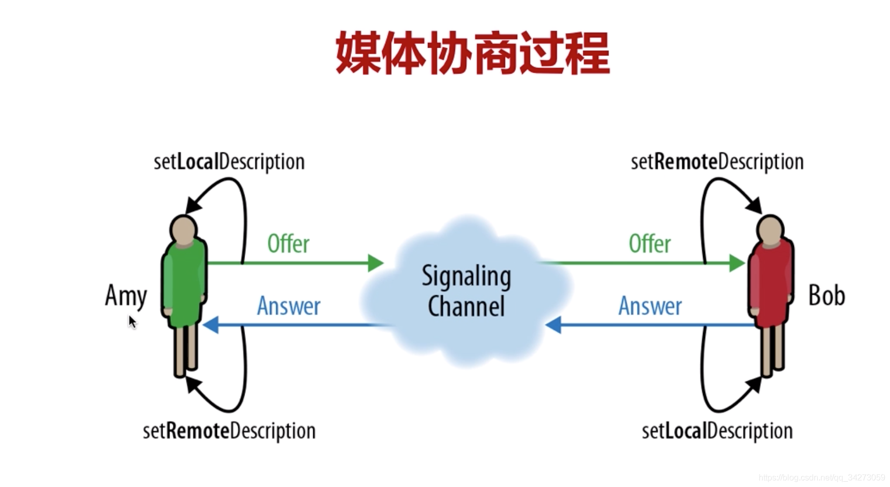
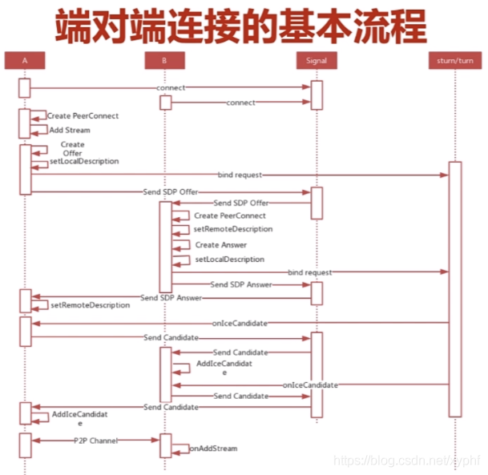

# <center>WebRTC</center>

## 简介

**定义**

WebRTC (Web Real-Time Communications) 是一项实时通讯技术，它允许网络应用或者站点，在不借助中间媒介的情况下，建立浏览器之间点对点（Peer-to-Peer）的连接，实现视频流和（或）音频流或者其他任意数据的传输。WebRTC 包含的这些标准使用户在无需安装任何插件或者第三方的软件的情况下，创建点对点（Peer-to-Peer）的数据分享和电话会议成为可能。


**WebRTC 架构**



## 媒体

**获取本地设备**

MediaDevices.enumerateDevices()

通过此方法可以获取媒体输入和输出设备的列表，例如麦克风，摄像机，耳机设备等

```js
// 列出相机和麦克风。

navigator.mediaDevices
  .enumerateDevices()
  .then(function (devices) {
    devices.forEach(function (device) {
      console.log(
        device.kind + ": " + device.label + " id = " + device.deviceId
      );
    });
  })
  .catch(function (err) {
    console.log(err.name + ": " + err.message);
  });
```

> 注意：获取本地设备列表，需要 https 协议 、

**获取本地媒体**

MediaDevices.getUserMedia()

```js
navigator.mediaDevices
  .getUserMedia(constraints)
  .then(function (stream) {
    /* 使用这个stream stream */
  })
  .catch(function (err) {
    /* 处理error */
  });
```

navigator.getUserMedia ( constraints, successCallback, errorCallback )

```js
var promise = navigator.mediaDevices.getUserMedia(constraints);
```

> 注: navigator.getUserMedia 已被废弃，使用 MediaDevices.getUserMedia()代替

API 参考地址：https://developer.mozilla.org/zh-CN/docs/Web/API/MediaDevices/getUserMedia

**媒体约束**  
在获取本地媒体时，可以通过给 getUserMedia 函数传参(constraints)来约束获取到的媒体，包括宽、高、采样率以及对音视频的处理(降噪/防抖等)

API 参考地址：https://developer.mozilla.org/zh-CN/docs/Web/API/MediaTrackConstraints

**媒体流与音视频轨道**

在浏览器中提供了媒体流的抽象类: **MediaStream**，一个流可以由多个轨道组合而成。下图展示了流与轨道之间的关系。



在 **MediaStream** 对象中可以通过 addTrack()和 getTracks()等方法来操作轨道。轨道抽象类 **MediaStreamTrack** 中也包含了轨道的状态(名字、类型等)。

MediaStream API 参考地址：https://developer.mozilla.org/zh-CN/docs/Web/API/MediaStream  
MediaStreamTrack API 参考地址：https://developer.mozilla.org/zh-CN/docs/Web/API/MediaStreamTrack

**媒体录制**

- 音视频录制

  浏览器提供了 MediaRecorder 类，可以录制流。

  API 参考地址: https://developer.mozilla.org/zh-CN/docs/Web/API/MediaRecorder

- 屏幕录制  
   MediaDevices.getDisplayMedia()

  ```js
  async function startCapture(displayMediaOptions) {
    let captureStream = null;

    try {
      captureStream = await navigator.mediaDevices.getDisplayMedia(
        displayMediaOptions
      );
    } catch (err) {
      console.error("Error: " + err);
    }
    return captureStream;
  }
  ```

  API 参考地址: https://developer.mozilla.org/zh-CN/docs/Web/API/MediaDevices/getDisplayMedia

## 信令服务器

**作用**

- 协商媒体功能和设置
- 标识和验证会话参与者的身份
- 控制媒体会话、指示进度、更改会话和终止会话
- 当会话双方同时尝试建立或更改会话时，实施双占用分解

## 网络基础

### NAT

**什么是 NAT ?**

NAT(Network Address Translation,网络地址转换)，也叫做网络掩蔽或者 IP 掩蔽。NAT 是一种网络地址翻译技术，主要是将内部的私有 IP 地址转换成可以在公网使用的公网 IP。

**为什么会有 NAT ?**

众所周知 IPv4 是 32 位的，满打满算也只有 2<sup>32</sup>(4294967296)个地址，很早就其他国家占用完毕。我们国家分到公网 IP 地址太少，不够用，所以采取了这种地址转换策略，这样就暂时解决了 IP 短缺的问题

**NAT 实现方式**

- **静态 NAT:**

  也就是静态地址转换。是指一个公网 IP 对应个私有 IP，是一对一转换。

- **动态 NAT**

  动态 NAT 是在路由器上配置一个外网 IP 地址池，当内部有计算机需要和外部通信时，就从地址池里动态的取出一个外网 IP，并将他们的对应关系绑定到 NAT 表中，通信结束后，这个外网 IP 才被释放，可供其他内部 IP 地址转换使用。

- **NAPT**

  端口多路复用技术。与静态 NAT 的差别是，NAPT 不但要转换 IP 地址还要进行端口转换。具体表现就是，对外只有一个公网 IP，通过端口来区别不同私有 IP 主机的数据。NAPT 主要分为两个大类: 锥型 NAT 和对称型 NAT。锥型又分为：完全锥型、受限锥型和端口受限锥型。

  - 完全锥型 NAT: IP 和端口都不受限

  

  - 受限锥型 NAT: IP 受限，端口不受限

  
  - 端口受限锥型 NAT: IP 和端口都受限

  
  - 对称型 NAT: 对每个外部主机或端口的会话都会映射为不同的端口

  

参考地址：

- https://zhuanlan.zhihu.com/p/116075005
- https://zhuanlan.zhihu.com/p/58019023
- https://baijiahao.baidu.com/s?id=1683718255812132596&wfr=spider&for=pc

### NAT穿越
  在WebRTC中，很多时候，我们希望网络中的两台主机能够直接进行通信，即所谓的P2P通信，而不需要其他公共服务器的中转。但是在现实网络环境中，大多数计算机主机都位于防火墙或NAT之后，只有少部分主机能够直接接入Internet。由于主机可能位于防火墙或NAT之后，在进行P2P通信之前，我们需要进行检测以确认它们之间能否进行P2P通信以及如何通信。这种技术通常称为NAT穿透（NAT Traversal）。 

**STUN**  
  STUN是一种网络协议，它允许应用程序发现它们与公共互联网之间存在的NAT和防火墙及其他类型。它也可以让应用程序确定NAT分配给它们的公网IP地址和端口号。STUN是一种Client/Server的模式，最开始在RFC3489中定义，现在已经被RFC5389取代。

**TURN**  
  解决对称NAT无法穿越的问题，建立在STUN协议只上，消息格式使用STUN格式消息。

**ICE**  
  ICE的全称Interactive Connectivity Establishment（互动式连接建立），由IETF的MMUSIC工作组开发出来的，它所提供的是一种框架，使各种NAT穿透技术可以实现统一。ICE跟STUN和TURN不一样，ICE不是一种协议，而是一个框架（Framework），它整合了STUN和TURN。


参考地址: 
  - http://www.52im.net/thread-557-1-1.html  
  - https://tools.ietf.org/html/rfc3489

## WebRTC端对端链接

### RTCPeerConection

__候选者__

__SDP__

### 媒体协商过程



### 端对端链接过程



